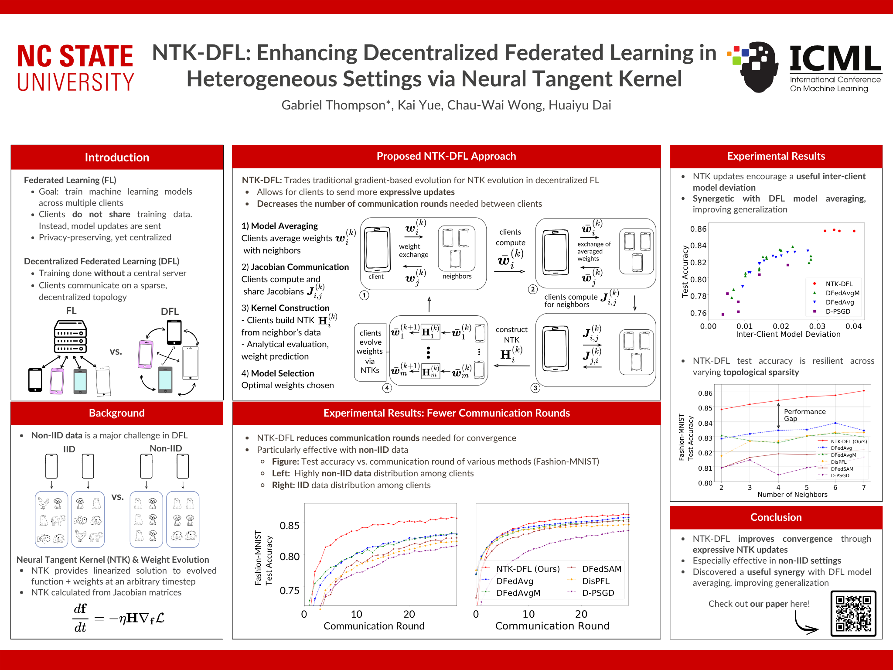

{}
I was fortunate enough to have the opportunity to present our work at ICML 2025 in Vancouver! ✈️✈️
{}

## ICML Poster
I was fortunate enough to have the opportunity to present our work at ICML 2025 in Vancouver! ✈️✈️

## Non-technical Overview

*I find that much of academic writing is overly jargon-heavy and intimidating. Here I give a short description of the paper in a more accessible tone.*

**A short summary**:
Collaborative training of machine learning models is gaining traction as large, ChatGPT-like models take an unprecedented amount of computing resources to train. Particularly, individuals may want to collaboratively train models without explicitly sharing their personal data, and without the need for a larger, central server. In other words, models may be trained in a decentralized fashion.
This introduces the problem of data heterogeneity: different users have different kinds of data! Your mom may love pictures of cats, while your brother only takes pictures of dogs and parrots. If we were training an animal classifier on these images, the variation of data across devices can hinder training.  
In our paper, we investigate a training algorithm that replaces the typical training approach with a new one. We use a mathematical tool called the neural tangent kernel. In plain English, this tool allows the user to share more expressive data in the training process. By sharing better data, model training is enhanced despite the data variation discussed prior. Also, users must communicate with over fewer rounds than in previously proposed algorithms. Lastly, we provide open-source code for the research community to test and build upon our algorithm.

<!-- {}
Create your slides in Markdown - click the _Slides_ button to check out the example.
{}
 -->
Add the publication's **full text** or **supplementary notes** here. You can use rich formatting such as including [code, math, and images](https://docs.hugoblox.com/content/writing-markdown-latex/).
